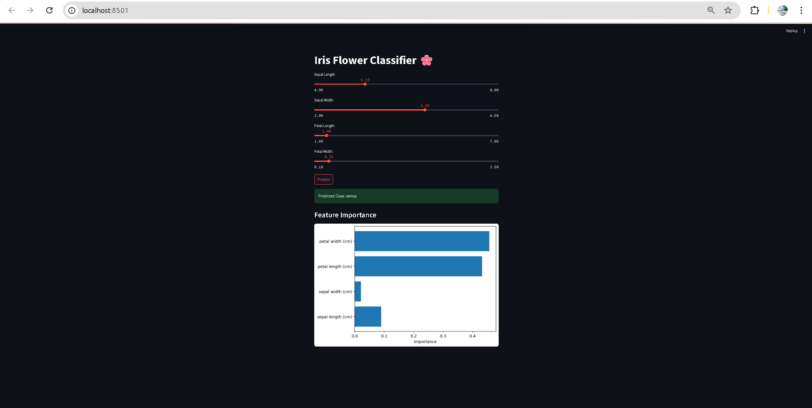

# 🌟 ML Model Deployment with Streamlit

This project demonstrates how to deploy a trained machine learning model using [Streamlit](https://streamlit.io). The app provides an interactive interface where users can input data, receive model predictions, and understand outputs through visualizations.
---

## 📁 Project Structure

```
Week_7/
│
├── app.py                    # Streamlit web app
├── model/
│   ├── model.py             # Model training script
│   └── trained_model.pkl    # Saved trained model
├── utils.py                 # Helper functions for model input and prediction
├── requirements.txt         # Project dependencies
├── image.png               # Application screenshot
├── Week_7.txt              # Additional project notes
└── README.md               # Project documentation
```

---

## 🚀 Features

- ✅ Train and save a machine learning model (Random Forest on Iris dataset)
- ✅ Deploy the model via a user-friendly Streamlit app
- ✅ Allow user input through interactive sliders
- ✅ Display predicted class with confidence
- ✅ Visualize feature importances
- ✅ Real-time prediction updates

---

## 🔧 Setup Instructions

### 1. **Clone the repository**
```bash
git clone <your-repository-url>
cd Week_7
```

### 2. **Install dependencies**
```bash
pip install -r requirements.txt
```

### 3. **Train the model** (if not already trained)
```bash
cd model
python model.py
cd ..
```

### 4. **Run the Streamlit app**
```bash
streamlit run app.py
```

### 5. **Access the application**
Open your browser and navigate to `http://localhost:8501`

---

## 📊 Model Details

- **Model**: RandomForestClassifier
- **Dataset**: Iris (from sklearn.datasets)
- **Features**: 
  - Sepal Length (cm)
  - Sepal Width (cm)
  - Petal Length (cm)
  - Petal Width (cm)
- **Target**: Iris flower species
  - 🌸 Setosa
  - 🌺 Versicolor  
  - 🌻 Virginica

---

## 📦 Dependencies

```txt
streamlit
scikit-learn
joblib
numpy
matplotlib
pandas
```

---

## 📸 Application Preview



*Interactive Streamlit interface showing model predictions and feature importance visualization*

---

## 🛠️ Technical Implementation

### Core Components:

1. **Model Training** (`model/model.py`)
   - Data loading and preprocessing
   - Model training and evaluation
   - Model serialization with joblib

2. **Web Application** (`app.py`)
   - Streamlit interface design
   - User input handling
   - Real-time predictions
   - Data visualization

3. **Utility Functions** (`utils.py`)
   - Input preprocessing
   - Prediction formatting
   - Helper functions

---

## 🎯 Usage

1. Launch the application using the setup instructions
2. Adjust the feature sliders to input your measurements
3. View the real-time prediction results
4. Explore feature importance charts
5. Experiment with different input combinations

---

## 🔮 Future Enhancements

- [ ] Add model performance metrics display
- [ ] Include data upload functionality
- [ ] Implement model comparison features
- [ ] Add batch prediction capabilities
- [ ] Include model explanation features (SHAP/LIME)

---

## 🙌 Acknowledgments

- [Streamlit Documentation](https://docs.streamlit.io/)
- [Scikit-learn](https://scikit-learn.org/)
- [Machine Learning Mastery](https://machinelearningmastery.com/)

---

## 📬 Contact

**Created by:** Saksham Tapadia

- 💼 **LinkedIn:** [saksham_tapadia](https://linkedin.com/in/saksham_tapadia)
- 📧 **Email:** sakshamtapadia10@gmail.com

---
